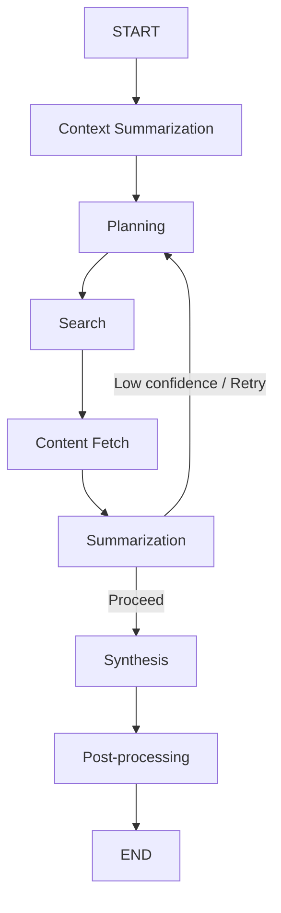

# 📚 Research Brief Generator

A **context-aware, AI-powered research assistant** built using **LangGraph**, **LangChain**, and **FastAPI**.
It generates **structured research briefs** from a given topic, leveraging LLMs, web search, content fetching, and summarization with context from past user queries.

---

## **1. Problem Statement and Objective**

**Problem:**
Researchers, analysts, and students often spend hours searching, reading, and synthesizing information from multiple sources.
Existing tools either:

* Give **generic summaries** without context.
* Or require **manual filtering & synthesis** of results.

**Objective:**
To create a **fully automated pipeline** that:

1. **Understands the research topic** (and user’s prior research context if available).
2. **Plans the research workflow** dynamically.
3. **Searches & fetches content** from reliable sources.
4. **Summarizes and synthesizes** findings into a structured research brief.
5. **Outputs JSON** for seamless integration into other apps.

## **2. Graph Architecture**

### **Workflow Steps:**



* **Context Summarization:** Uses prior research history to add relevant context.
* **Planning:** Generates a structured research plan with steps and priorities.
* **Search:** Runs targeted web searches for each research step.
* **Content Fetch:** Downloads and parses article content.
* **Summarization:** Extracts relevant insights from each source.
* **Synthesis:** Combines summaries into a coherent research brief.
* **Post-processing:** Adds token usage, metadata, and final touches.

---

## **3. Model and Tool Selection Rationale**

| Component                  | Choice                       | Rationale                                                          |
| -------------------------- | ---------------------------- | ------------------------------------------------------------------ |
| LLM for planning/synthesis | **ChatGroq (gemma2-9b-it)**  | Balanced speed & reasoning capability. Structured output support.  |
| Search API                 | **DuckDuckGo Search (DDGS)** | No API keys needed, privacy-friendly, and supports instant search. |
| HTML Parsing               | **BeautifulSoup4**           | Robust parsing for varied website structures.                      |
| Workflow Engine            | **LangGraph**                | Allows stateful, node-based execution with retries.                |
| API Framework              | **FastAPI**                  | High performance, built-in validation with Pydantic.               |

---

## **4. Schema Definitions and Validation Strategy**

**Schemas:**

* `ResearchPlan` → Holds topic, steps, estimated time, and priorities.
* `SourceSummary` → Summarized content of each fetched source.
* `FinalBrief` → Final structured output.
* `ContextSummary` → Links current research with past topics.
* `BriefRequest` → Request validation (topic, depth, follow-up, user\_id).

**Validation Strategy:**

* **Pydantic Models** enforce type safety & required fields.
* `@field_validator` ensures step lists aren’t empty.
* Union types (`Annotated[Union[str, list], operator.add]`) handle state merging in LangGraph.

---

### **Local Setup**

```bash
# Clone the repository
git clone 'https://github.com/palakbansal8810/research-brief-generator.git'
cd research-brief-generator

# Create virtual environment
python -m venv venv
source venv/bin/activate  # (Windows: venv\Scripts\activate)

# Install dependencies
pip install -r requirements.txt

# Run the server
uvicorn app:app --reload
```

**Environment Variables (`.env`):**

```
GROQ_API_KEY=your_groq_key_here
LANGSMITH_TRACING_V2="true"
LANGSMITH_ENDPOINT="https://api.smith.langchain.com"
LANGSMITH_API_KEY=" "
LANGSMITH_PROJECT="research-brief-generator"

```
**For Testing**

```
set PYTHONPATH=%PYTHONPATH%;%CD%
pytest tests/ --verbose  

```
---

## **6. Example Requests and Outputs**

### **POST /brief**

**Request:**

```json
{
    "topic": "Impact of AI on Education",
    "depth": 3,
    "follow_up": false,
    "user_id": "user123"
}
```

**Response:**

```json
{
  "id": "a1b2c3",
  "title": "Research Brief: Impact of AI on Education",
  "summary": "AI is transforming education through personalized learning...",
  "sections": [
    {
      "heading": "Overview",
      "content": "Artificial Intelligence (AI) is reshaping...",
      "key_points": ["Personalized learning", "Automation of grading"]
    }
  ],
  "references": [
    {"title": "AI in Education Report", "url": "https://example.com", "relevance_score": 0.85}
  ],
  "metadata": {"depth": 3, "sources_count": 5, "follow_up": false},
  "created_at": "2025-08-15T12:00:00Z"
}
```

---

## **7. Cost and Latency Benchmarks**

| Operation             | Avg Time (sec) | Cost (tokens)      |
| --------------------- | -------------- | ------------------ |
| Context Summarization | 1.2            | \~300 tokens       |
| Planning              | 1.0            | \~200 tokens       |
| Search + Fetch        | 3.5            | -                  |
| Summarization         | 4.0            | \~1,000 tokens     |
| Synthesis             | 2.5            | \~700 tokens       |
| **Total**             | **12.2 sec**   | **\~2,200 tokens** |


---

## **8. Limitations and Areas for Improvement**

**Limitations:**

* Relies on DuckDuckGo → No guarantee of academic journal inclusion.
* Summarization accuracy depends on LLM capability.
* HTML parsing may miss data on JS-heavy sites.
* Context awareness limited to stored local history.

**Future Improvements:**

* Integrate **Google Scholar API** or **Semantic Scholar** for academic sources.
* Add **citation formatting** (APA, MLA).
* Support **multi-language briefs**.
* Implement **real-time streaming output** for large briefs.

